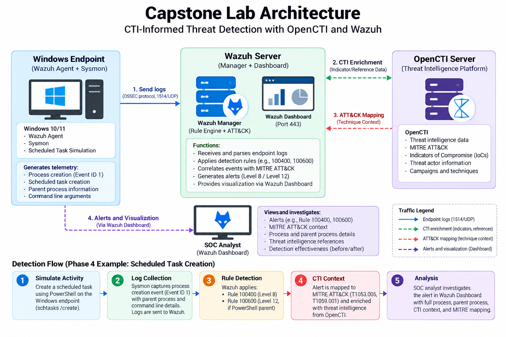
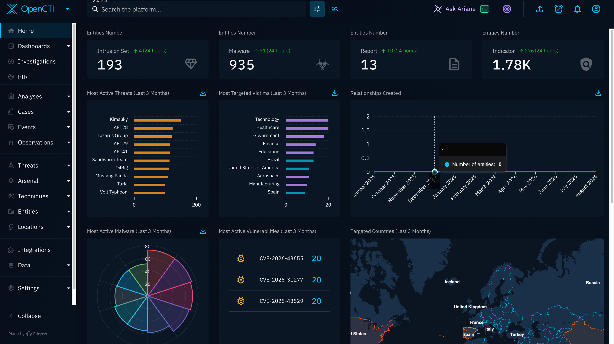
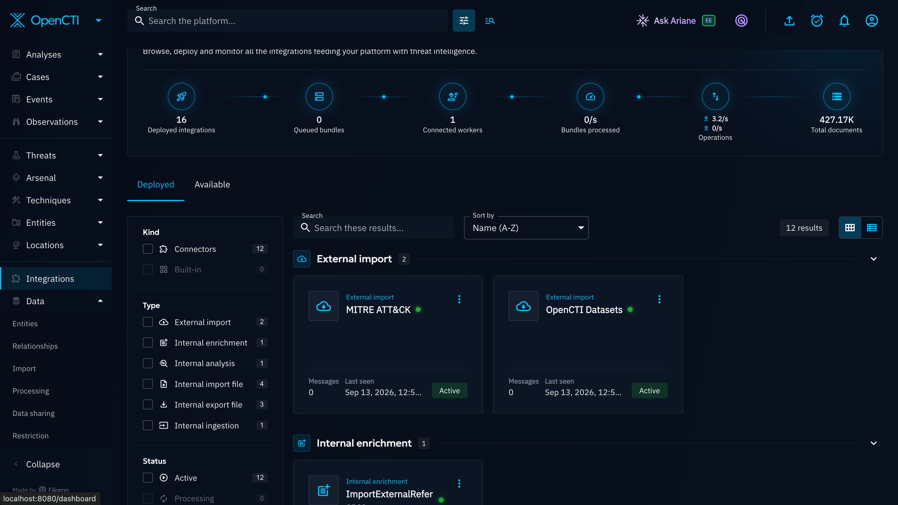
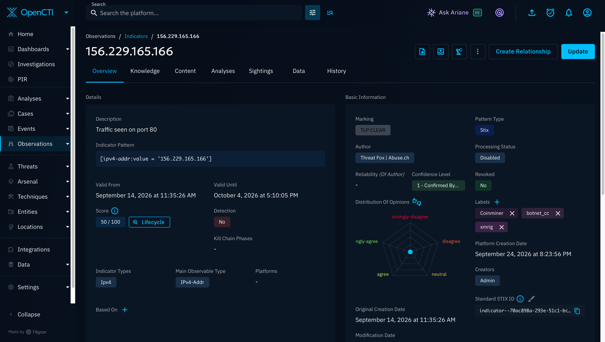
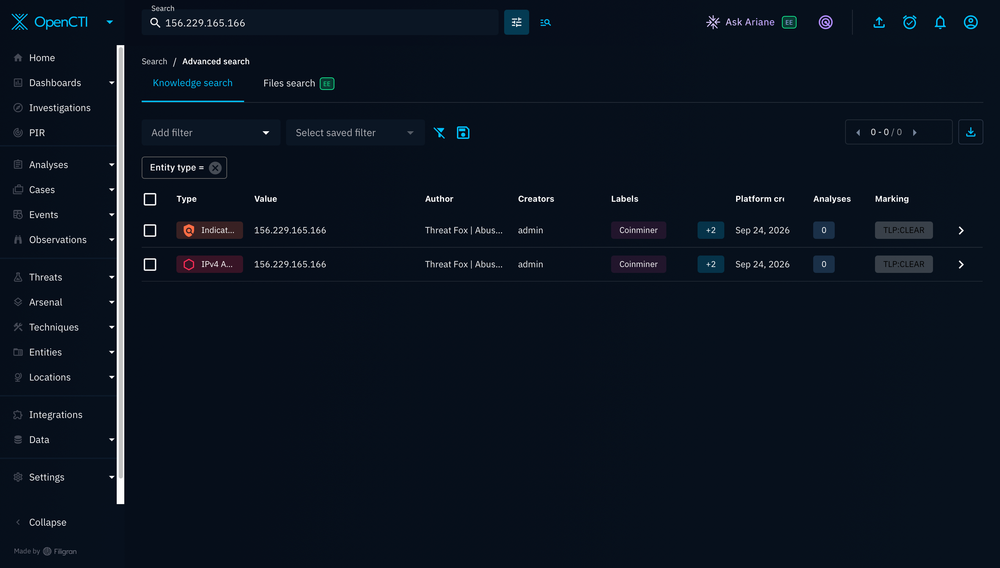
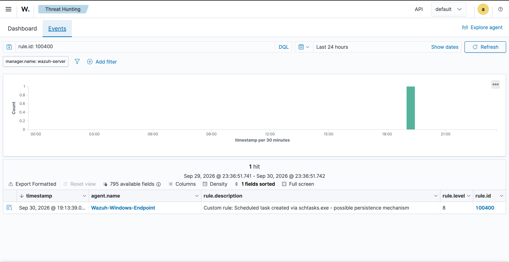
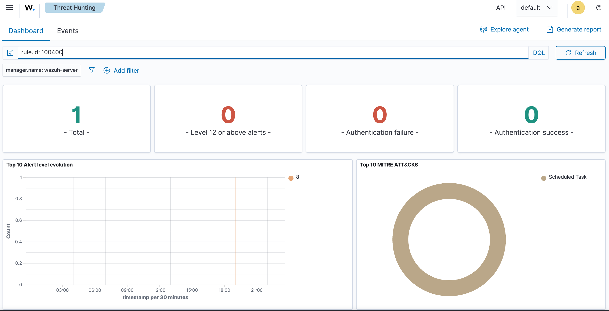
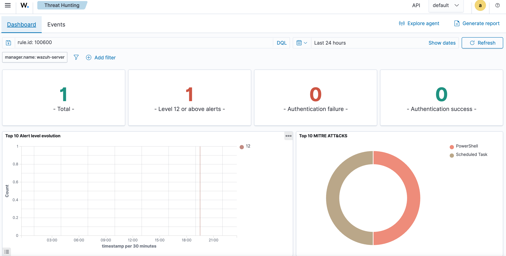

# Threat Intelligence Integration with OpenCTI and Wazuh

A hands-on SOC Analyst capstone project that integrates **OpenCTI threat intelligence** with a **Wazuh SIEM** lab to collect CTI, analyse indicators, enrich alerts, and improve a Windows detection rule using **MITRE ATT&CK** context.

## Project Overview

The project was built around an existing Wazuh SOC lab with a Windows endpoint monitored by **Wazuh Agent and Sysmon**.

The project was completed in four main areas:

1. **OpenCTI deployment** — deployed OpenCTI as the central threat-intelligence platform.
2. **Threat intelligence ingestion** — connected external sources including ThreatFox, AlienVault OTX, and MITRE ATT&CK.
3. **OpenCTI → Wazuh enrichment** — built a CDB-based indicator path and a custom API enrichment workflow.
4. **Detection engineering** — improved Wazuh Rule **100400** into Rule **100600** by adding PowerShell parent-process context.

## Architecture

The overall workflow was:

`Windows Endpoint → Sysmon → Wazuh → OpenCTI enrichment → SOC Analyst`



**Figure 1 —** Lab architecture showing the Windows endpoint, Sysmon, Wazuh, OpenCTI, CTI enrichment, and SOC analyst workflow.


## Objectives

- Deploy OpenCTI and connect it to external threat-intelligence feeds.
- Connect OpenCTI with Wazuh using a CDB indicator list and a custom enrichment script.
- Test the enrichment workflow with a controlled Wazuh alert and use real Wazuh telemetry where applicable.
- Use CTI and MITRE ATT&CK context to improve an existing Wazuh detection rule.
- Document the results, challenges, and lessons learned.

---

# 1. OpenCTI Deployment

OpenCTI was used as the central platform for managing threat intelligence.

It provided a place to work with:

- Indicators and observables
- Threat-intelligence context
- Relationships
- MITRE ATT&CK information
- Threat actors and related information

### Evidence



**Figure 2 —** OpenCTI dashboard showing the platform populated with threat-intelligence data.

> **Upload:** `opencti/opencti-dashboard.png`

I used OpenCTI as the central platform for collecting and managing threat intelligence.

## Result

OpenCTI was successfully deployed and populated with threat-intelligence data.

---

# 2. Threat Intelligence Ingestion

The lab used several external intelligence sources.

| Source | Purpose |
|---|---|
| **ThreatFox (Abuse.ch)** | Malicious IP and domain indicators |
| **AlienVault OTX** | Broader threat-intelligence coverage |
| **MITRE ATT&CK** | Adversary tactics and techniques |
| **OpenCTI Datasets** | Additional intelligence for platform population |

At the time of the project screenshots, OpenCTI contained a populated set of threat-intelligence data, including indicators, malware, intrusion sets, and reports.

### Evidence



**Figure 3 —** OpenCTI integrations showing the connected threat-intelligence sources and MITRE ATT&CK.

---

# 3. Indicator Analysis

One of the indicators used during the project was:

```
156.229.165.166
```

OpenCTI showed the indicator as sourced from **ThreatFox / Abuse.ch** with:

- Confidence score: **50/100**
- TLP: **CLEAR**
- Labels including:
  - Coinminer
  - botnet_cc
  - xmrig

The indicator was used to demonstrate the OpenCTI enrichment workflow.

### Evidence



**Figure 4 —** OpenCTI indicator analysis for 156.229.165.166 showing its threat-intelligence source, confidence score, TLP marking, and associated labels.

---

# 4. OpenCTI → Wazuh Integration

Two integration paths were developed.

## 4.1 Batch Indicator Export

Indicators were exported from OpenCTI into a Wazuh CDB list:

```
opencti-ips
```

This allows Wazuh to perform local indicator lookups against network events.

## 4.2 Live Enrichment Lookup

When a Wazuh alert is sent for enrichment:

```
Wazuh Alert
    ↓
wazuh-integratord
    ↓
Custom Python Enrichment Script
    ↓
OpenCTI API
    ↓
Threat Intelligence Context
    ↓
Enrichment Log
```

The enrichment script successfully queried OpenCTI for `156.229.165.166`, found the related threat-intelligence record, and wrote the result to the enrichment log.

### Evidence



**Figure 5 —** Wazuh CDB list and configuration used for the OpenCTI indicator-matching path.

The indicator used for the controlled enrichment test is shown in the [indicator analysis evidence](threat-intelligence/opencti-enrichment-indicator.png).

*Controlled OpenCTI → Wazuh enrichment test: the script queried OpenCTI for 156.229.165.166 and wrote the returned context to the enrichment log. The detailed output is also documented in the final report.*

## Important Limitation

The live custom Wazuh IOC-match alert did not fire as expected for the tested Sysmon event pattern.

The issue was investigated and documented. The custom enrichment workflow itself was demonstrated successfully using a **controlled Wazuh alert and a real OpenCTI indicator match**.

No live IOC match is claimed where one was not observed.

---

# 5. Detection Engineering

## 5.1 Baseline Detection — Rule 100400

The baseline rule detected scheduled-task creation using:

```
schtasks.exe /create
```

It was mapped to:

```
T1053.005 — Scheduled Task
```

The rule generated a **Level 8** alert during controlled testing.

### Evidence



**Figure 5 —** Baseline Wazuh detection: Rule 100400 generated a Level 8 alert for scheduled-task creation.

**Detailed event evidence:** Upload the event screenshot as `detection-engineering/baseline-rule-100400-event.png`.

---

## 5.2 Improved Detection — Rule 100600

Rule **100600** was added without changing the original Rule 100400.

The improved rule checks for scheduled-task creation where **PowerShell or pwsh.exe is the parent process**.

```xml
<rule id="100600" level="12">
  <if_sid>100400</if_sid>
  <field name="win.eventdata.parentImage" type="pcre2">(?i)\\(powershell|pwsh)\.exe$</field>
  <description>CTI-informed detection: Scheduled task created by PowerShell - elevated persistence risk</description>
  <mitre>
    <id>T1053.005</id>
    <id>T1059.001</id>
  </mitre>
  <group>persistence,scheduled_task,powershell,cti_informed,</group>
</rule>
```

The improved rule generated a **Level 12** alert during controlled testing.

### Why the rule was improved

The original Sysmon event already contained the parent-process information. The improvement did not require new telemetry; it used data that was already being collected but was not being evaluated by the baseline rule.

### Evidence



**Figure 6 —** Improved Wazuh detection: Rule 100600 generated a Level 12 alert with PowerShell parent-process context.

> **Upload this image as:** `detection-engineering/improved-rule-100600-dashboard.png`

**Detailed event evidence:** Upload the event screenshot as `detection-engineering/improved-rule-100600-event.png`.

---

# 6. Before vs After

| Attribute | Rule 100400 — Baseline | Rule 100600 — Improved |
|---|---|---|
| Alert level | 8 | 12 |
| Trigger | `schtasks.exe /create` | `schtasks.exe /create` + PowerShell parent |
| ATT&CK | T1053.005 | T1053.005 + T1059.001 |
| Parent process | Not evaluated | PowerShell explicitly required |
| Test | Controlled scheduled-task simulation | Controlled scheduled-task simulation |

### Evidence



**Figure 7 —** Side-by-side comparison of the baseline and improved Wazuh detections.

> **Upload this image as:** `detection-engineering/before-after-detection.png`

> **The main improvement was adding process context rather than treating every scheduled-task creation as equally suspicious.**

---

# 7. Validation

The main Phase 4 validation flow was:

```
PowerShell
   ↓
schtasks.exe /create
   ↓
Sysmon Event ID 1
   ↓
Wazuh Detection Rule
   ↓
SOC Alert
```

Both the baseline and improved rules were tested on the Windows endpoint.

**Atomic Red Team was not used for the final Phase 4 test.** A controlled manual scheduled-task simulation was used instead.

---

# 8. Challenges and Lessons Learned

### Challenge

The live custom IOC alerting path did not consistently generate the expected Wazuh alert even though the relevant telemetry and rule configuration were checked.

### Lessons

- Review existing telemetry before adding new data sources.
- Choose an integration method based on the SOC use case.
- Separate telemetry receipt, decoding, rule loading, rule evaluation, and alert generation during troubleshooting.
- Use `wazuh-logtest` to test rule logic against real event data.
- Document repeatable limitations instead of claiming results that were not observed.
- Manage resources carefully when running OpenCTI and multiple virtual machines on a small system.

---

# 9. Key Results

### Successfully demonstrated

- OpenCTI deployment
- External CTI ingestion
- MITRE ATT&CK integration
- Indicator analysis
- OpenCTI API lookup
- Controlled OpenCTI → Wazuh enrichment
- Wazuh detection engineering
- Baseline scheduled-task detection
- Improved scheduled-task detection
- Before/after validation

### Documented limitation

- Live custom IOC alerting for the affected Sysmon event pattern did not produce the expected custom alert.

---

# 10. Project Deliverables

## Final Report

The final project report is stored in the repository:

`report/Threat_Intelligence_Integration_OpenCTI_Report.pdf`

## Presentation

The project presentation is stored in the repository:

`presentation/OpenCTI_Threat_Intelligence_Presentation.pptx`

## Evidence Screenshots

The repository is organised by topic so each screenshot has a clear purpose. The uploaded images are shown directly in the relevant sections above. The repository also contains the full PDF report and PowerPoint presentation.

Store project evidence in the topic folders:

```
architecture/
opencti/
threat-intelligence/
enrichment/
detection-engineering/
```

---

# Repository Layout

After uploading the evidence, the repository should look like:

```
opencti-threat-intelligence-capstone-/
│
├── README.md
│
├── architecture/
│   └── capstone-lab-architecture.png
│
├── opencti/
│   └── opencti-dashboard.png
│
├── threat-intelligence/
│   ├── opencti-feed-integrations.png
│   └── opencti-indicator-156-229-165-166.png
│
├── enrichment/
│   └── (enrichment result documented in report)
│
├── detection-engineering/
│   ├── baseline-rule-100400.png
│   ├── improved-rule-100600.png
│   └── before-after-detection.png
│
├── report/
│   └── Threat_Intelligence_Integration_OpenCTI_Report.pdf
│
└── presentation/
    └── OpenCTI_Threat_Intelligence_Presentation.pptx
```

---

# Skills Demonstrated

- Threat intelligence ingestion and indicator analysis
- OpenCTI platform administration
- Wazuh SIEM integration and enrichment
- IOC management using a Wazuh CDB list
- MITRE ATT&CK mapping
- Windows/Sysmon telemetry analysis
- Detection rule development and validation
- Evidence-based troubleshooting and documentation

---

# Tools and Technologies

- **OpenCTI**
- **Wazuh**
- **Sysmon**
- **MITRE ATT&CK**
- **ThreatFox / Abuse.ch**
- **AlienVault OTX**
- **Python**
- **Docker**
- **VirtualBox**
- **Windows**

---

# Security Note

This repository should contain **no passwords, API tokens, encryption keys, `.env` files, or other secrets**.

The project was created as an educational SOC lab and is not intended to represent a production security architecture.

---

## Author

**Makinde Boluwatife**

SOC Analyst Trainee

**Project:** Threat Intelligence Integration with OpenCTI

**Status:** Completed with a documented live IOC-alerting limitation.

GitHub: [CyberTife](https://github.com/CyberTife)
